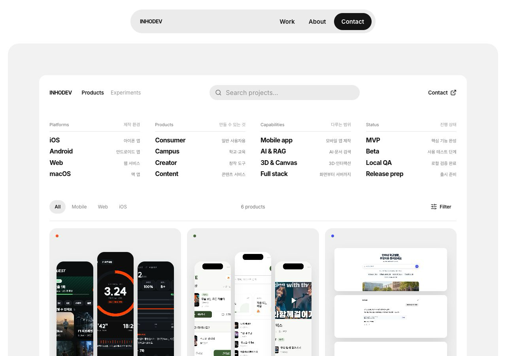
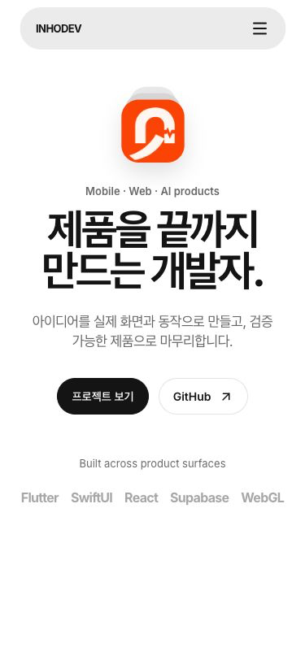
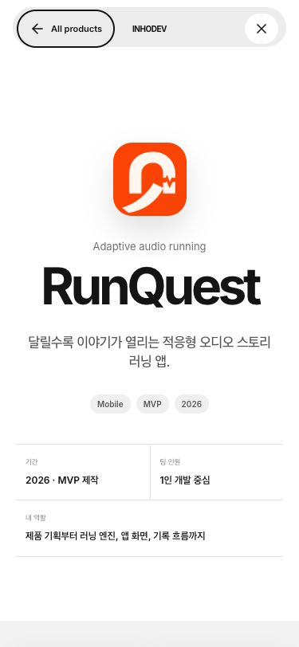

<div align="center">
  <p><strong>INHODEV · PRODUCT PORTFOLIO</strong></p>
  <h1>제품을 끝까지 만드는 개발자.</h1>
  <p>
    아이디어를 실제 화면과 동작으로 만들고,<br />
    확인 가능한 제품으로 마무리한 여섯 가지 작업을 소개합니다.
  </p>
  <p><code>Mobile</code> · <code>Web</code> · <code>AI</code> · <code>Product Delivery</code></p>
</div>

<p align="center">
  
</p>

## 이 포트폴리오가 보여주는 것

프레임워크 목록보다 **무엇을 만들었고 어디까지 직접 책임졌는지**가 먼저 보이도록 구성했습니다. 각 프로젝트는 실제 제품 화면을 중심으로 소개하고, 상세 화면에서 기간·작업 방식·담당 범위와 확인된 검증 경계를 함께 보여줍니다.

- 모바일 앱, 웹 서비스, AI 검색 경험을 하나의 카탈로그에서 탐색
- 프로젝트마다 직접 만든 핵심 결과 3가지를 짧고 구체적으로 정리
- 기술 이름보다 사용자 흐름과 완성된 동작을 먼저 설명
- 수상·사용자 수·후기처럼 확인되지 않은 사회적 증거는 사용하지 않음
- 모바일 메뉴, 검색, 플랫폼 필터, 상세 탐색, 다음 프로젝트 연결 지원

## Featured work

| Project | 무엇을 만들었는지 | 직접 맡은 범위 | 현재 표시 상태 |
|---|---|---|---|
| **RunQuest** | 달릴수록 이야기가 열리는 적응형 오디오 러닝 앱 | 제품 기획, 러닝 엔진, 앱 화면, 기록 흐름 | MVP |
| **OLIVE** | 기분과 상황에 맞는 찬양 큐레이션 플랫폼 | 제품 기획, 모바일 앱, 추천 흐름, 운영 화면 | Beta |
| **INHA AI** | 공식 출처가 있을 때만 답하는 캠퍼스 생활 AI | 질문 경험, 근거 검색, 답변 안전장치, 운영 구조 | Local MVP |
| **COSMODAY** | 매일 하나의 우주 사건을 만나는 iOS 캘린더 | 콘텐츠 기획, iOS 앱, 위젯, 연간 제작 흐름 | Beta |
| **TOY** | 작은 창작물을 만드는 복셀 소셜 월드 | 세계관, iOS 화면, 생성 로직, 다국어 QA | Headless QA |
| **Rewind** | 사이드 프로젝트 완주를 돕는 개인 회고 파트너 | 제품 기획, iOS 앱, 회고 흐름, 출시 준비 | Release prep |

<p align="center">
  
  &nbsp;&nbsp;
  
</p>

## 경험 설계

```text
첫인상
  └─ 무엇을 만드는 사람인지 이해
      └─ 실제 제품 화면으로 프로젝트 탐색
          └─ 기간 · 작업 방식 · 내 역할 확인
              └─ 직접 만든 결과와 검증 범위 확인
                  └─ 다음 프로젝트로 자연스럽게 이동
```

카드는 스크린샷 탐색을 방해하지 않으면서 `내가 만든 핵심 3가지`를 펼쳐볼 수 있습니다. 상세 화면은 키보드 포커스, `Escape` 닫기, 원래 카드로의 포커스 복귀까지 포함해 동작합니다.

## 확인된 범위

이 저장소의 문구는 현재 코드와 로컬 검증에서 확인된 범위만 사용합니다.

- `npm run build` 프로덕션 빌드 완료
- `npm run test:sites` 정적 자산·SPA fallback 패키징 테스트 4개 통과
- 375px, 768px, 1280px 화면에서 가로 넘침 없이 주요 흐름 확인
- 여섯 프로젝트 상세의 기본 정보·이미지·다음 프로젝트 연결 확인
- Cloudflare Pages는 **배포 예정 대상**이며 아직 공개 URL로 배포하지 않음

빌드 성공은 실제 사용자 수, 매출, 출시 상태 또는 외부 서비스 연동을 증명하지 않습니다. 각 프로젝트의 더 구체적인 검증 경계는 포트폴리오 상세 화면에 표시합니다.

## Local development

```bash
npm ci
npm run dev
```

프로덕션 빌드와 패키징 테스트:

```bash
npm run build
npm run test:sites
```

## Cloudflare Pages 배포 설정

GitHub 저장소 연결 후 다음 값으로 배포할 수 있습니다.

| Setting | Value |
|---|---|
| Production branch | `main` |
| Build command | `npm run build` |
| Build output directory | `dist/client` |

공개 URL은 실제 배포와 라이브 검증이 끝난 뒤 이 문서에 추가합니다.

## Repository map

```text
src/                 포트폴리오 화면과 상호작용
public/projects/     여섯 프로젝트의 실제 제품 이미지
docs/readme/         GitHub README용 선별 미리보기
scripts/             빌드 패키징과 선택적 브라우저 QA 도구
tests/               정적 호스팅 패키징 테스트
worker/              SPA fallback을 제공하는 정적 자산 Worker
```

## Built with

React 19, Vite 6, token-driven CSS, Lucide icons, Node.js test runner로 구성했습니다. 기술 스택은 제품 설명을 보조하는 정보이며, 포트폴리오의 중심은 실제 화면과 직접 맡은 결과입니다.

---

<p align="center">
  프로젝트와 협업 문의는 <a href="https://github.com/inhodev">GitHub @inhodev</a>에서 확인할 수 있습니다.
</p>
